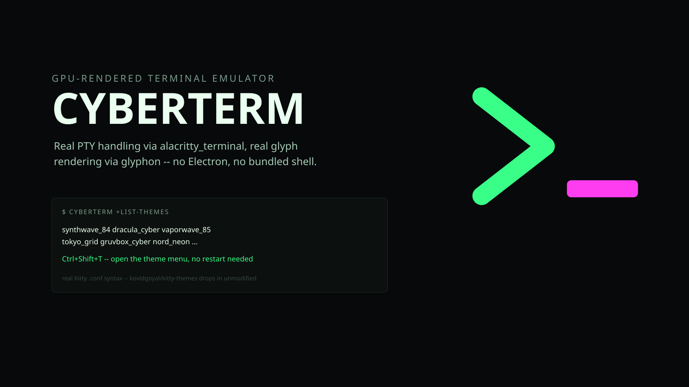

<p align="center"></p>

# 📟 cyberterm

[](https://github.com/cybercore-tech/cyberterm/actions/workflows/ci.yml)
[](https://github.com/cybercore-tech/cyberterm/actions/workflows/release.yml)

`Rust` · `wgpu` · `alacritty_terminal` · `glyphon`

**A GPU-rendered terminal emulator.** Real PTY handling and VT parsing via
`alacritty_terminal`, glyph rendering via `glyphon` (cosmic-text + etagere
on a wgpu pipeline), the Kitty keyboard protocol, shell integration with
prompt jumping, 12 built-in Kitty-format themes plus the shared Cybercore
theme catalog, and a config file that applies the moment you save it. No
Electron, no bundled shell.

**[cybercore-tech.github.io/cyberterm](https://cybercore-tech.github.io/cyberterm/)**

## 📦 Install

```bash
curl -fsSL https://raw.githubusercontent.com/cybercore-tech/cyberterm/main/install.sh | sh
```

Downloads the latest release for your platform (Linux x86_64/aarch64,
or macOS aarch64/Apple Silicon), verifies its SHA-256 checksum, and
installs `cyberterm` to `~/.local/bin`. Linux needs the usual desktop
GL/X11/Wayland libraries already present — nothing extra to install for
the binary itself. No Intel Mac build — GitHub's `macos-13` runner
queue capacity has been too degraded to build one reliably in CI; build
from source with `cargo build --release` there instead.

## 🚀 Commands

```bash
cyberterm                          # launch the terminal
cyberterm +list-themes             # list every theme found in ~/.config/cyberterm/themes
cyberterm +set-theme <name>        # switch theme and save it as the default
cyberterm +set-opacity --custom=0.85
cyberterm +edit-theme --create-theme <category> <folder> <name>
cyberterm +edit-theme --view-theme <category> <folder> <name>
cyberterm +edit-theme --remove-theme <category> <folder> <name>
cyberterm +list-termkeys           # the effective keybindings, including your overrides
cyberterm +default-config          # a commented config with every default
cyberterm +shell-integration zsh   # the integration script for zsh, bash or fish
cyberterm +layout [file|dir]       # open a layout (default ./.cyberterm/layout.toml)
cyberterm +ctl <method> [k=v ...]  # control a running Cyberterm (cyberterm +ctl help)
cyberterm +attach [name] [--force] [--tty]  # reattach a daemon session (window, or in this terminal)
cyberterm +sessions                # list daemon sessions
cyberterm +history [words]         # search saved commands and their output
cyberterm +json [file]             # browse JSON as a collapsible tree (or pipe it in)
cyberterm +kill-session <name>     # end a daemon session and its shells
cyberterm +mcp                     # MCP server so AI agents can work with your panes (+mcp --help)
```

## ⌨️ Keys and mouse

| Keys | Action |
|---|---|
| `Ctrl+Shift+C` / `Ctrl+Shift+V` | Copy / paste (bracketed paste when the program asks for it) |
| `Ctrl+Insert` / `Shift+Insert` | Copy / paste, so Omarchy's universal Super+C / Super+V work |
| Middle click | Paste the primary selection |
| `Ctrl+Shift+A` | Select the whole scrollback |
| `Shift+PageUp` / `Shift+PageDown` | Scroll a page |
| `Ctrl+Shift+Up` / `Ctrl+Shift+Down` | Scroll a line |
| `Shift+Home` / `Shift+End` | Top of the scrollback / back to the live screen |
| `Ctrl+Shift+Z` / `Ctrl+Shift+X` | Jump to the previous / next shell prompt |
| `Ctrl+Shift+K` | Clear the scrollback |
| `Ctrl+Shift+F` | Find in the scrollback (Enter older, Shift+Enter newer) |
| `Ctrl+Shift+H` | Search command history (commands and their output) |
| `Ctrl+=` / `Ctrl+-` / `Ctrl+0` | Bigger / smaller / reset font |
| `Ctrl+Shift+,` | Theme picker |
| `Ctrl+Shift+R` | Reload the config now |

Rebind or free any of them under `[keybindings]` (`"ctrl+shift+k" = "none"`
hands that combo back to the shell).

Mouse: drag to select (double-click for a word, triple-click for a line,
Alt+drag for a block, Shift+click to extend). Finished selections are copied
to the primary selection by default; set `[mouse] copy_on_select` to
`"clipboard"` or `"both"` to have them land on the regular clipboard too.
Right-click opens a menu with Copy, Paste, Select All, Open/Copy Link,
Clear Scrollback, Themes and Reload Config (Shift+right-click while a
program has mouse reporting on). The wheel scrolls the scrollback; in full-screen programs
without mouse support (`less`, `man`) it sends arrow keys. Programs that
turn on mouse reporting (vim, htop, tmux, fzf) get clicks, drags and the
wheel in SGR, UTF-8 or X10 encoding; hold Shift to select text anyway.
Hyperlinks, both OSC 8 links and plain `https://` URLs, underline on hover
and open with Ctrl+click.

## 🪟 Splits and tabs

Splits and tabs use Ghostty's default keys, so Ghostty muscle memory carries
over:

| Keys | Action |
|---|---|
| `Ctrl+Shift+O` / `Ctrl+Shift+E` | Split right / down |
| `Ctrl+Shift+W` | Close the pane (the window closes with the last one) |
| `Ctrl+Alt+Arrows` | Move focus between panes |
| `Ctrl+Super+]` / `Ctrl+Super+[` | Next / previous pane |
| `Ctrl+Super+Shift+Arrows` | Resize (Omarchy's `+Alt` variant works too) |
| `Ctrl+Super+Shift+=` | Equalize splits |
| `Ctrl+Shift+Enter` | Zoom the pane to the whole tab (toggle) |
| `Ctrl+Shift+B` | Broadcast: type into every pane of the tab (toggle) |
| `Ctrl+Shift+T` | New tab |
| `Ctrl+Tab` / `Ctrl+Shift+Tab` | Next / previous tab |
| `Alt+1`…`Alt+8`, `Alt+9` | Go to tab N, last tab |
| `Ctrl+Shift+PageUp/PageDown` | Move the tab left / right |
| `Ctrl+Shift+N` | New window |

New panes and tabs open in the focused shell's directory. Click a pane to
focus it, drag a divider to resize, click a tab to switch, middle-click it
to close. Unfocused panes are dimmed (`[splits] inactive_dim`), the tab bar
shows while there's more than one tab (`[tabs] bar`), and a tab with an
unseen bell gets a dot.

**tmux users:** set `[keyboard] leader = "ctrl+b"` (or any key) and use
tmux's keys after it: `%` `"` split, `x` close, `z` zoom, `o` next pane,
arrows focus, `Ctrl+arrows` resize, `c` new tab, `n`/`p` next/previous,
`1`–`9`, `&` close tab. Press the leader twice to send it to the program.
Add your own as `"leader+v" = "split_right"`.

### Layouts as code

Put a `.cyberterm/layout.toml` in a project and `cyberterm +layout` opens
the whole workspace: tabs, splits and what runs where. Commands are typed
into a shell once its prompt is up, so the shell stays when they exit.

```toml
[[tab]]
title = "dev"
[tab.layout]
split = "right"
ratio = 0.6
[[tab.layout.panes]]
command = "nvim ."
focus = true
[[tab.layout.panes]]
split = "down"
panes = [{ command = "cargo watch -x test" }, { command = "npm run dev", cwd = "web" }]

[[tab]]
title = "logs"
layout = { command = "journalctl --user -f" }
```

### Sessions that outlive the window

Turn on the session daemon and closing a window (or a crash) no longer ends
its shells:

```toml
[daemon]
enabled = true
```

The daemon (`cyberterm +daemon`) starts on demand and owns every shell. A
window attaches to a session, gets an exact replay of each pane (scrollback,
colors, links, prompt marks, full-screen apps like vim or less), then the
live output. Close the window and the session detaches: builds keep
building, servers keep serving. Open Cyberterm again and the most recent
detached session comes back with its tabs and splits (`[daemon] reattach`),
or pick one with `cyberterm +attach <name>`. `cyberterm +sessions` lists
them; the daemon exits by itself once the last session ends.

**From another terminal or over SSH:** `cyberterm +attach` with no display
(an SSH login, a console), or with `--tty`, attaches inside the terminal
you're in. It draws the active tab's splits as text with a status line;
keys go straight to the focused pane, and the pane's input modes
(application keys, bracketed paste, mouse, Kitty keyboard) are mirrored onto
your terminal so programs behave as they would locally. Bells, titles and
clipboard copies (OSC 52) reach your terminal too.

Commands are `Ctrl+\` then a key: `d` detach, `%` / `"` split, `x` close,
`z` zoom, `o` or arrows to move between panes, `c` new tab, `n` / `p` /
`1`–`9` tabs, `&` close tab, `b` broadcast, `?` help; `Ctrl+\` twice
sends it to the program. A session open in a window can be taken over with
`--force` (the window says so). With no detached session to resume,
`cyberterm +attach` starts a new one, like `tmux new -A`.

### Control socket

A running Cyberterm listens on a user-only Unix socket
(`$XDG_RUNTIME_DIR/cyberterm/<pid>.sock`, exported to its shells as
`CYBERTERM_SOCKET`). It speaks JSON-RPC 2.0, one request per line, and
`cyberterm +ctl` wraps it:

```bash
cyberterm +ctl list-panes                             # ids, titles, cwds, sizes, last exit codes
cyberterm +ctl split direction=down command="htop"    # returns the new pane id
cyberterm +ctl get-text pane=3 lines=50               # plain text, ready to pipe
cyberterm +ctl send-text pane=3 text=$'make test\r'
cyberterm +ctl new-tab title=logs cwd=~/src command="tail -f app.log"
```

This is the same API the planned background daemon and the MCP bridge for AI
agents will use. Turn it off with `[control] enabled = false`.

## 🧱 Command blocks and history

With shell integration on, every command becomes a **block**:

- **Margin bar:** each block gets a colored bar (green succeeded, red failed, yellow still running).
- **Badge:** each block shows its exit code and how long it took, e.g. `✓ 1.2s`, `✗ 2 · 3.4s`.
- **Right-click a block** to:
  - copy its output or command
  - **rerun** it (in place, or in a new pane)
  - **watch** it (a pane that reruns it every 2 seconds)
  - **diff its output with the previous run**, from the scrollback or from history
- **Last command's output:** `Ctrl+Shift+G` opens it in a pager; `Ctrl+Shift+Y` copies it.
- **Long commands:** when one that ran 10s or more finishes while you're looking elsewhere (another window, tab or pane), you get a desktop notification (`[notify] long_command_seconds`).

**History with output.** Finished commands are saved to a searchable SQLite
database (`~/.local/share/cyberterm/history.sqlite3`): the command, its
output, exit code, directory, timing, host and session, from every window
and the daemon. Common secrets (tokens, keys, passwords, private keys) are
redacted before anything is written; commands typed with a leading space
are never saved, and `[history] ignore` takes extra patterns.

```bash
cyberterm +history                      # recent commands
cyberterm +history curl health          # commands or output containing both words
cyberterm +history --failed --here      # failures in this directory
cyberterm +history --output 42          # everything command 42 printed
```

The same search is on the control socket (`cyberterm +ctl history query=...`),
and in the window with **Ctrl+Shift+H**:

- **Search:** type to search commands and their output.
- **Preview:** the selected command's saved output is shown below the list.
- **Keys:** Enter puts the command at your prompt, Ctrl+Enter runs it, Tab opens its full output in a pane.

### Smart output

- **File references:** `src/main.rs:42:7`, Rust's `--> src/x.rs:12:5`, compiler and linter errors, `grep -n` output, Node and Go stack traces, Python's `File "x.py", line 12` and `file.cs(12,5)`.
  - They underline on hover; Ctrl+click (or right-click → Open) opens them in your editor at that line.
  - Paths resolve against the directory the command ran in, and only existing files are linked.
  - The editor comes from `$VISUAL`/`$EDITOR`. Terminal editors (nvim, vim, helix, nano, micro, kakoune) open in a new pane, GUI editors (VS Code, Zed, Sublime) in their own window. `[links] editor` takes a template such as `"nvim +{line} {file}"`.
- **JSON:** a block whose output is JSON gets **View as JSON** in its menu, which opens `cyberterm +json`: a collapsible tree.
  - Arrows/`hjkl` move, Enter folds, `e`/`c` expand or collapse everything.
  - `/` searches, `y` copies the node's path (`.items[3].name`) and `Y` its value.
  - It works on its own too: `curl -s api/health | cyberterm +json`, including JSON Lines.

## 🤖 AI agents

`cyberterm +mcp` is an [MCP](https://modelcontextprotocol.io) server, so any agent that speaks MCP can work with your terminal: Claude Code, Codex CLI, Gemini CLI, Cursor, Zed and others.

```bash
claude mcp add cyberterm -- cyberterm +mcp     # Claude Code
codex mcp add cyberterm -- cyberterm +mcp      # Codex CLI
# anything else: command "cyberterm", args ["+mcp"], stdio transport
```

- **Tools:** `list_panes`, `read_pane`, `recent_commands` (command, exit code, duration and output), `search_history`, `run_command` (in a new pane), `wait_for_command`, `send_text`.
  - Run from inside Cyberterm, the agent works with that window; from elsewhere, with the most recently started one.
- **You stay in charge:**
  - The first time an agent reads a pane, a prompt asks you. Typing into a pane or running a command asks every time.
  - Answer with **Enter** to allow once, **a** to allow for that pane (or, for commands, from then on), or **Esc** to deny.
  - What will be typed is shown with Enter and control keys made visible, so nothing hides in it.
  - Commands run in a new pane split below yours, so you see them and keep your focus.
- **You can see what agents do:**
  - Panes an agent works with show a `◆ agent-name` badge.
  - Right-click → **Revoke Agent Access** withdraws its grants for that pane.
  - Every request is logged to `~/.local/state/cyberterm/agents.log`.
- **Settings:** `[agents]` sets `read` and `write` to `"ask"`, `"allow"` or `"deny"`; `enabled = false` turns agent access off.

The prompts keep well-behaved agents from acting silently. They aren't a sandbox: a program already running as you can reach the control socket directly.

### Ask and Explain

Cyberterm can also ask a model for help:

- **Explain this error:** a failed command's right-click menu has **Explain with AI**, and **Ctrl+Shift+J** explains the newest failure in the pane. The model gets the command, its exit code and output, the directory and git state, and returns what went wrong plus a fix when there is one.
- **Plain English to a command:** **Ctrl+Shift+I**, then type what you want ("find files over 100MB here", "undo my last commit but keep the changes").

Answers come with a risk rating: safe, caution or dangerous. Cyberterm also checks the command itself for things like recursive deletes, force-pushes, `curl | sh`, disk writes and `sudo`, and raises the rating if the model rated it too low.

**Enter** types the command at your prompt. It never runs until you press Enter yourself. **c** copies it, **Esc** closes the panel.

Pick a provider in `[ai]`:

```toml
[ai]
provider = "anthropic"                   # key in ANTHROPIC_API_KEY; model defaults to claude-opus-5-5
# provider = "openai"                    # any OpenAI-compatible API (key in OPENAI_API_KEY)
# model = "gpt-5"
# provider = "openai"                    # Ollama or LM Studio on this machine, no key
# base_url = "http://localhost:11434/v1"
# model = "qwen3:8b"
# provider = "command"                   # any CLI that reads the prompt on stdin
# command = ["claude", "-p"]
```

Before anything is sent, command output is redacted (tokens, passwords and keys are stripped, as in saved history) and trimmed to the last 12,000 characters (`max_context_chars`). The panel header shows which model and host it goes to.

## 🛡 Power features

### Danger mode

A pane turns red when a mistake there would cost more:
- it's connected over SSH to a host matching `[danger] hosts` (default `*prod*`);
- it's running a root shell (`sudo -i`, `su`);
- it's sitting in a directory matching `[danger] paths`;
- or you marked it with **Ctrl+Shift+D** (press again to unmark).

A dangerous pane gets a red border, a faint red tint, a `⚠ ssh prod-db` badge and a `⚠` on its tab.

If you press Enter on a risky command there, Cyberterm holds the Enter and shows the command with the reason (for example "deletes recursively", "force-pushes"). Enter again runs it, and any other key cancels.
- **What counts as risky:** the same check the AI panel uses. `confirm = "caution"` also covers sudo, overwrites and kills; `"off"` turns the check off.
- **Programs that take over the screen:** full-screen programs such as editors and pagers are left alone.
- **Over SSH:** it works without shell integration on the remote side.

Detection reads `/proc` once a second, so `ssh prod-db` and `exit` change the pane's state on their own. AI agents see a pane's danger state in `list_panes`, and their consent prompts flag a dangerous target.

## 🐚 Shell integration

```bash
eval "$(cyberterm +shell-integration zsh)"    # ~/.zshrc
eval "$(cyberterm +shell-integration bash)"   # ~/.bashrc
cyberterm +shell-integration fish | source    # ~/.config/fish/config.fish
```

The script makes the shell report its working directory (OSC 7), mark each
prompt and command (OSC 133) and send the command line itself. That powers
prompt jumping, command blocks, history and opening new panes in the same
directory. Re-source it after upgrading to pick up the command line.
The marks are stored on the terminal cells themselves, so they scroll,
reflow on resize and age out of the scrollback with the text they belong to.
The escapes are harmless in other terminals.

## 🛠 Configuration

`~/.config/cyberterm/cyber_config.toml`. Every key is optional, and changes
apply within a second of saving. Run `cyberterm +default-config` for the full
commented reference:

```toml
theme = "synthwave_84"
opacity = 0.9

[font]
family = "JetBrainsMono Nerd Font"
size = 9.0            # points, like Ghostty/Kitty/Alacritty
line_height = 1.25
fallback = ["Symbols Nerd Font Mono", "Noto Color Emoji"]

[cursor]
style = "block"       # block | beam | underline
blinking = false

[scrollback]
lines = 10000

[clipboard]
osc52 = "copy"        # disabled | copy | paste | copy-paste

[keybindings]
"ctrl+alt+c" = "copy"
```

12 curated Kitty-syntax themes ship built-in (`~/.config/cyberterm/themes/*.conf`)
and load unmodified, so anything pulled straight from
[kovidgoyal/kitty-themes](https://github.com/kovidgoyal/kitty-themes) drops in
next to them with zero conversion. `+edit-theme` writes your own custom
themes as JSON under a `category/folder/` layout alongside the built-ins.
Press `Ctrl+Shift+,` in the terminal to open the theme picker.

Cyberterm also loads the shared Cybercore theme catalog. Its semantic
background, foreground, and accent colors map to the terminal's 16 ANSI
slots; Cyberterm's local Kitty and JSON themes remain available in the same
picker. Choosing a shared theme saves the selection to the shared Cybercore
catalog, so compatible Cybercore apps follow that selection too. Cyberterm
uses the published `cybercore` 0.8 crate and checks the shared catalog
revision once a second, so updates from Theme Studio or another Cybercore
app apply without a restart.

## ⚙️ Rendering

- **Text:** `glyphon` (cosmic-text shaping + an etagere glyph atlas) on wgpu,
  with bold, italic, dim, strikethrough and five underline styles (single,
  double, curly, dotted, dashed), including colored underlines.
- **Alignment:** each row is cut into ASCII runs plus individually placed
  wide and non-ASCII glyphs (CJK, emoji, Nerd Font icons, combining marks).
  A fallback font with a different advance width can't push the rest of the
  line out of alignment.
- **Shaping cache:** shaping is cached by row content, so scrolling and
  redraws don't re-shape unchanged text.
- **Fonts:** only the configured fonts are loaded at startup. The first time
  a character none of them covers appears, fontconfig finds a font that has
  it.
- **Box drawing:** box-drawing and block-element characters are drawn as
  rectangles from the cell geometry, so TUI borders join seamlessly at any
  font size or line height.
- **Opacity:** window opacity fades cell backgrounds only. Text stays fully
  opaque, matching how Ghostty/Kitty/Alacritty do transparency.

## 🗺 Known limitations

- Without `[daemon] enabled`, shells live in the window's process and end
  with it. The daemon is opt-in while it's new.
- The terminal attach client has no scrollback view of its own yet (use the
  program's own scrolling or attach from a window), and forwards mouse
  reports only to programs using SGR mouse mode (nearly all do).
- No scrollback search yet.
- No sixel or Kitty graphics protocol (inline images) yet.

## 🚦 Quality gate

```bash
./scripts/release-gates quick   # fmt + check + clippy
./scripts/release-gates full    # quick + tests + strict rustdoc
```

See [`CONTRIBUTING.md`](CONTRIBUTING.md) for what each step checks and why
the render/PTY/input path can't be covered by automated tests.

## ⚖️ Namespace & Legal Attribution

This project is an independent component of the **Cybercore Systems Framework** hosted canonically at [cybercore-tech.github.io](https://cybercore-tech.github.io/).

**Copyright (c) 2026 Cybercore Tech (cybercore-tech.github.io)**

Permission is hereby granted, free of charge, to any person obtaining a copy of this software and associated documentation files (the "Software"), to deal in the Software without restriction, including without limitation the rights to use, copy, modify, merge, publish, distribute, sublicense, and/or sell copies of the Software, and to permit persons to whom the Software is furnished to do so, subject to the following conditions:

The above copyright notice and this permission notice shall be included in all copies or substantial portions of the Software.

THE SOFTWARE IS PROVIDED "AS-IS", WITHOUT WARRANTY OF ANY KIND, EXPRESS OR IMPLIED, INCLUDING BUT NOT LIMITED TO THE WARRANTIES OF MERCHANTABILITY, FITNESS FOR A PARTICULAR PURPOSE AND NONINFRINGEMENT. IN NO EVENT SHALL THE AUTHORS OR COPYRIGHT HOLDERS BE LIABLE FOR ANY CLAIM, DAMAGES OR OTHER LIABILITY, WHETHER IN AN ACTION OF CONTRACT, TORT OR OTHERWISE, ARISING FROM, OUT OF OR IN CONNECTION WITH THE SOFTWARE OR THE USE OR OTHER DEALINGS IN THE SOFTWARE.

### 🛡️ Defensive Guardrail Statement

All software components, tools, prefixes, and configurations under the "Cyber" prefix within this ecosystem are developed completely independently as open-source utilities for specialized terminal environments. They maintain absolutely no affiliation, partnership, endorsement, sponsorship, or commercial connection with any external corporate cybersecurity providers, training collectives, or federal defense contractors. Prior art is formally registered and maintained immutably via active domain publication.

**Contact:** [dev@cybercoretech.net](mailto:dev@cybercoretech.net) // [cybercore-tech.github.io](https://cybercore-tech.github.io/)
